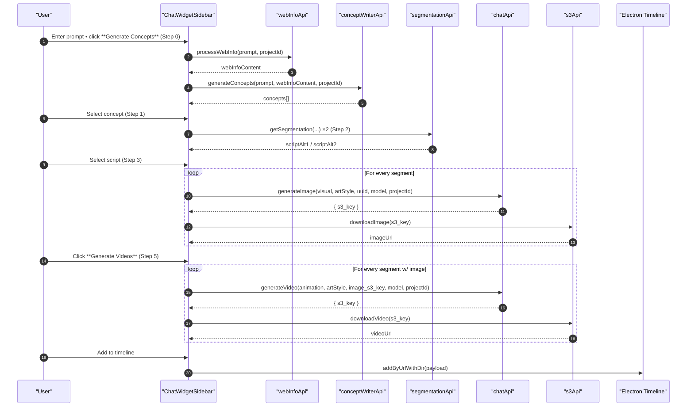

# ChatWidget – End-to-End Flow & API Reference

This document explains **how the six-step AI pipeline implemented in `frontend/src/components/ChatWidget.jsx` works**, which APIs are invoked at every stage, and how state, credits and timeline export are handled.

---

## 1. High-level Sequence



---

## 2. Components

| File / Component | Purpose |
|------------------|---------|
| `ChatWidget.jsx` | Thin wrapper; holds `open` boolean and hides Electron *Publish* button while the chat is open. |
| `ChatWidgetSidebar` | **All logic & UI** for the pipeline, including step list, inputs, modals and state management. |
| `StepList` | Collapsible visual tracker for the six steps. |
| `InputArea` | Prompt input + helper buttons that advance steps. |
| Modals | Character generator, project creation, redo-with-model, image/video preview. |

---

## 3. React State Map (`ChatWidgetSidebar`)

| State | Description |
|-------|-------------|
| `currentStep` `0‥5` | Drives which UI is shown and which API method can be executed. |
| `stepStatus` `{ id: 'pending' | 'loading' | 'done' }` | Visual indicators & gating logic. |
| `prompt` | User text prompt shared by all generation calls. |
| `concepts`, `selectedConcept` | Data for Steps 0 & 1. |
| `scripts`, `selectedScript` | Alternative script responses for Steps 2 & 3. |
| `generatedImages`, `generatedVideos` | `{ segmentId → url }` maps created in Steps 4 & 5. |
| `generationProgress` | Fine-grained status per segment (generating / completed / error). |
| `selectedImageModel`, `selectedVideoModel` | Chosen AI models (defaults provided by `chatApi.getDefaultModel`). |
| Project / credit | `selectedProject`, `storedVideosMap`, etc. Handle persistence & credit refresh. |

---

## 4. Step-by-Step Execution

### Step 0 – Concept Writer (`runConceptWriter`)
1. `webInfoApi.processWebInfo(prompt, projectId)` – fetches live web context.
2. `conceptWriterApi.generateConcepts(prompt, webInfoContent, projectId)` – returns **concepts[]**.
3. On success →
   * `concepts` saved
   * `stepStatus[0] = "done"`
   * UI navigates to **Step 1**.
4. Credit cost = `getTextCreditCost('web-info') + getTextCreditCost('concept generator')`.

---

### Step 1 – Choose Concept (UI only)
User clicks a card → `selectedConcept` set, step 1 **done**, move to Step 2.

---

### Step 2 – Script Generation (`runScriptGeneration`)
* Two parallel calls to `segmentationApi.getSegmentation(...)` return alternate scripts.
* Store as `scripts = { response1, response2 }`, mark step 2 **done**, go to Step 3.
* Credit cost = `getTextCreditCost('script & segmentation') × 2`.

---

### Step 3 – Choose Script (UI only)
User selects one script → `selectedScript` saved, step 3 **done**, proceed to Step 4.

---

### Step 4 – Image Generation (`runImageGeneration`)
For **each** segment in `selectedScript.segments`:
1. `chatApi.generateImage({ visual_prompt, art_style, uuid, project_id, model })`.
2. Receive `{ s3_key }` then `s3Api.downloadImage(s3_key)` → CloudFront URL.
3. Update `generatedImages` and `generationProgress`.
After all promises settle → step 4 **done**, auto-advance to Step 5.
Credit = `getImageCreditCost(model) × segmentCount`.

---

### Step 5 – Video Generation (`runVideoGeneration`)
For segments that now have images:
1. `chatApi.generateVideo({ animation_prompt, art_style, image_s3_key, uuid, project_id, model })`.
2. Receive `{ s3_key }` → `s3Api.downloadVideo(s3_key)`.
3. Update `generatedVideos` & progress.
Upon completion → step 5 **done**.
Credit = `getVideoCreditCost(model, seconds=5) × segmentCount`.

---

### Timeline Export
* `sendVideosToTimeline` (multi-segment) or `addSingleVideoToTimeline` (one segment).
* Payload example:
  ```js
  [ { id: 3, url: "https://ds0fghatf06yb.cloudfront.net/abc123.mp4" } ]
  ```
* Bridges tried in order:
  1. `window.api.ext.timeline.addByUrlWithDir / addByUrl`
  2. `window.electronAPI.req.timeline.addByUrlWithDir / addByUrl`
  3. `ipcRenderer.invoke('extension:timeline:addByUrlWithDir', payload)`
* Success → `timelineProgress` is reset and a listener (`electronAPI.res.timeline.add`) counts items actually added.

---

## 5. API Module Reference

| Module | Method(s) | Returned fields |
|--------|-----------|-----------------|
| **web-info** `../services/web-info` | `processWebInfo(prompt, projectId)` | `choices[0].message.content` |
| **concept-writer** `../services/concept-writer` | `generateConcepts(prompt, webInfo, projectId)` | `concepts[]` |
| **segmentation** `../services/segmentationapi` | `getSegmentation({ prompt, concept, project_id })` | `segments[]` etc. |
| **chat** `../services/chat` | `generateImage(...)`, `generateVideo(...)`, `getDefaultModel(genType)` | `{ s3_key }` |
| **s3** `../services/s3` | `downloadImage(s3_key)`, `downloadVideo(s3_key)` | Public CloudFront URL |
| **project** `../services/project` | `getProject*`, `createProject()` | Varies – used for persistence | 

All service files use an `axios` instance under `frontend/src/lib/axiosInstance.js`.

---

## 6. Credit Tracking

Helpers from `frontend/src/lib/pricing.js`:
```js
getTextCreditCost(serviceName)
getImageCreditCost(model)
getVideoCreditCost(model, seconds)
formatCreditDeduction(label, credits)
```
`showCreditDeduction(serviceName, model, count)` consolidates cost, shows a green toast for 3 s, and refreshes balance via `useProjectStore().fetchBalance(user.id)`.

---

## 7. Error Handling
* API failures → `setError()` displays a red banner and the step reverts to **pending**.
* Per-segment failures in Steps 4-5 are marked in `generationProgress` (`status: 'error'`).
* Timeline errors show “Failed to add …” banner.

---

## 8. Extending / Customising

| Goal | Where to change |
|------|-----------------|
| Support new generation models | Add in backend, update `chatApi.getAvailableModels` & `<ModelSelector />`. Add pricing in `pricing.js`. |
| Adjust credit costs | Edit helper functions in `pricing.js`. |
| Add an extra pipeline step | 1) Append to `steps[]` array, 2) implement `runXxx()` method, 3) update `isStepDisabled`, `updateStepStatus`, `getStepIcon`. |
| Override max video length | Pass different `seconds` to `getVideoCreditCost` & to backend video-generation endpoint. |

---

## 9. Related Files
* `frontend/src/components/ChatWidget.jsx`
* `frontend/src/components/chat-widget/*` – floating button, step list UI.
* `frontend/src/services/*` – API wrappers.
* `frontend/src/lib/pricing.js` – credit cost table & helpers.
* Root Electron timeline implementation: `apps/app/.../controllers/timeline.ts` & IPC bridge under `electron/ipc/ipcTimeline.ts`.

---

> **Generated:** _(YYYY-MM-DD)_
