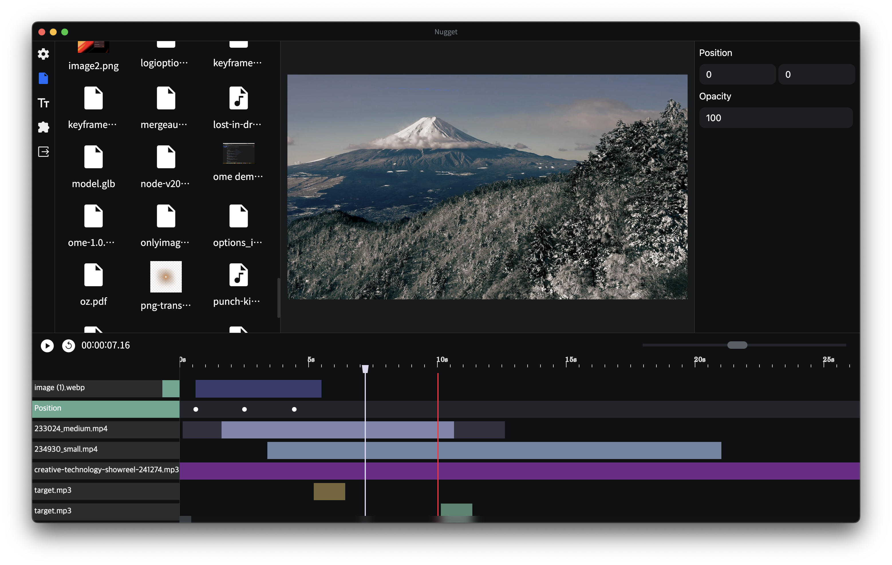

# nugget-app



[English](../README.md) | 한국어

<hr/>

모션 효과와 범용성에 집중한 비디오 편집 소프트웨어 입니다.

기본적인 컷 편집 및 애니메이션, 사운드 믹싱, 외부 라이브러리 확장, 프로젝트 관리, 텍스트 편집 기능 외에도 다양한 기능을 제공합니다.

## Features

- 컷 편집
- 오디오 믹싱
-

## 설치

먼저, 의존성을 설치합니다.

```
npm install
```

그리고 ffmpeg와 ffprobe를 "./bin" 폴더에 집어넣어야 합니다. Mac용 버전과 Windows용 버전이 따로 있습니다. 호환되는 바이너리 파일은 https://github.com/cartesiancs/ffmpeg4nugget 에서 다운로드할 수 있습니다.

다음으로 **권한** 부여가 필요합니다. 빈 폴더에 대한 권한을 부여하려면 아래 명령을 입력하세요.

`chmod -R 777 bin`

## 실행

아래 명령을 통해 실행할 수 있습니다.

```
npm run dev
npm run start
```
